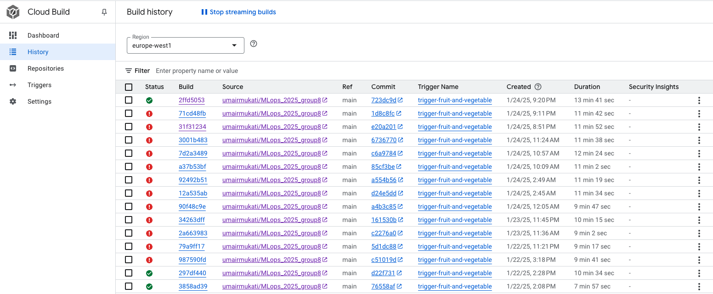

# Exam template for 02476 Machine Learning Operations

This is the report template for the exam. Please only remove the text formatted as with three dashes in front and behind
like:

```--- question 1 fill here ---```

Where you instead should add your answers. Any other changes may have unwanted consequences when your report is
auto-generated at the end of the course. For questions where you are asked to include images, start by adding the image
to the `figures` subfolder (please only use `.png`, `.jpg` or `.jpeg`) and then add the following code in your answer:

```markdown

```

In addition to this markdown file, we also provide the `report.py` script that provides two utility functions:

Running:

```bash
python report.py html
```

Will generate a `.html` page of your report. After the deadline for answering this template, we will auto-scrape
everything in this `reports` folder and then use this utility to generate a `.html` page that will be your serve
as your final hand-in.

Running

```bash
python report.py check
```

Will check your answers in this template against the constraints listed for each question e.g. is your answer too
short, too long, or have you included an image when asked. For both functions to work you mustn't rename anything.
The script has two dependencies that can be installed with

```bash
pip install typer markdown
```

## Overall project checklist

The checklist is *exhaustive* which means that it includes everything that you could do on the project included in the
curriculum in this course. Therefore, we do not expect at all that you have checked all boxes at the end of the project.
The parenthesis at the end indicates what module the bullet point is related to. Please be honest in your answers, we
will check the repositories and the code to verify your answers.

### Week 1

* [X] Create a git repository (M5)
* [X] Make sure that all team members have write access to the GitHub repository (M5)
* [X] Create a dedicated environment for you project to keep track of your packages (M2)
* [X] Create the initial file structure using cookiecutter with an appropriate template (M6)
* [X] Fill out the `data.py` file such that it downloads whatever data you need and preprocesses it (if necessary) (M6)
* [X] Add a model to `model.py` and a training procedure to `train.py` and get that running (M6)
* [X] Remember to fill out the `requirements.txt` and `requirements_dev.txt` file with whatever dependencies that you
    are using (M2+M6)
* [X] Remember to comply with good coding practices (`pep8`) while doing the project (M7)
* [X] Do a bit of code typing and remember to document essential parts of your code (M7)
* [X] Setup version control for your data or part of your data (M8)
* [X] Add command line interfaces and project commands to your code where it makes sense (M9)
* [X] Construct one or multiple docker files for your code (M10)
* [X] Build the docker files locally and make sure they work as intended (M10)
* [X] Write one or multiple configurations files for your experiments (M11)
* [X] Used Hydra to load the configurations and manage your hyperparameters (M11)
* [X] Use profiling to optimize your code (M12)
* [X] Use logging to log important events in your code (M14)
* [X] Use Weights & Biases to log training progress and other important metrics/artifacts in your code (M14)
* [X] Consider running a hyperparameter optimization sweep (M14)
* [ ] Use PyTorch-lightning (if applicable) to reduce the amount of boilerplate in your code (M15)

### Week 2

* [X] Write unit tests related to the data part of your code (M16)
* [X] Write unit tests related to model construction and or model training (M16)
* [X] Calculate the code coverage (M16)
* [X] Get some continuous integration running on the GitHub repository (M17)
* [X] Add caching and multi-os/python/pytorch testing to your continuous integration (M17)
* [ ] Add a linting step to your continuous integration (M17)
* [ ] Add pre-commit hooks to your version control setup (M18)
* [ ] Add a continues workflow that triggers when data changes (M19)
* [ ] Add a continues workflow that triggers when changes to the model registry is made (M19)
* [X] Create a data storage in GCP Bucket for your data and link this with your data version control setup (M21)
* [X] Create a trigger workflow for automatically building your docker images (M21)
* [ ] Get your model training in GCP using either the Engine or Vertex AI (M21)
* [X] Create a FastAPI application that can do inference using your model (M22)
* [X] Deploy your model in GCP using either Functions or Run as the backend (M23)
* [X] Write API tests for your application and setup continues integration for these (M24)
* [X] Load test your application (M24)
* [X] Create a more specialized ML-deployment API using either ONNX or BentoML, or both (M25)
* [X] Create a frontend for your API (M26)

### Week 3

* [ ] Check how robust your model is towards data drifting (M27)
* [ ] Deploy to the cloud a drift detection API (M27)
* [ ] Instrument your API with a couple of system metrics (M28)
* [ ] Setup cloud monitoring of your instrumented application (M28)
* [ ] Create one or more alert systems in GCP to alert you if your app is not behaving correctly (M28)
* [ ] If applicable, optimize the performance of your data loading using distributed data loading (M29)
* [ ] If applicable, optimize the performance of your training pipeline by using distributed training (M30)
* [ ] Play around with quantization, compilation and pruning for you trained models to increase inference speed (M31)

### Extra

* [X] Write some documentation for your application (M32)
* [X] Publish the documentation to GitHub Pages (M32)
* [X] Revisit your initial project description. Did the project turn out as you wanted?
* [X] Create an architectural diagram over your MLOps pipeline
* [X] Make sure all group members have an understanding about all parts of the project
* [X] Uploaded all your code to GitHub

## Group information

### Question 1
> **Enter the group number you signed up on <learn.inside.dtu.dk>**
>
> Answer:

group 8

### Question 2
> **Enter the study number for each member in the group**
>
>
> Answer:

Hui Wang s210331, Xinyi Liu s232258, Yufan Wang s232213, Xiao Xiao s232189, Muhammad Umair Mukati mumukati@jabra.com

### Question 3
> **A requirement to the project is that you include a third-party package not covered in the course. What framework**
> **did you choose to work with and did it help you complete the project?**
>
> Recommended answer length: 100-200 words.
>
> Example:
> *We used the third-party framework ... in our project. We used functionality ... and functionality ... from the*
> *package to do ... and ... in our project*.
>
> Answer:

We sourced our "fruit and vegetable" dataset directly from kagglehub. Following package was installed: kagglehub==0.3.6.
We used streamlit webrtc for live camera feed in the frontend. Following package was installed: streamlit_webrtc==0.47.9.
Currently, our model does not work well with images from camera, possibly indicating data-drift.

We did not use any higher level frameworks such as pytorch lightning. We wished to have the training/testing scripts flexible.

## Coding environment

> In the following section we are interested in learning more about you local development environment. This includes
> how you managed dependencies, the structure of your code and how you managed code quality.

### Question 4

> **Explain how you managed dependencies in your project? Explain the process a new team member would have to go**
> **through to get an exact copy of your environment.**
>
> Recommended answer length: 100-200 words
>
> Example:
> *We used ... for managing our dependencies. The list of dependencies was auto-generated using ... . To get a*
> *complete copy of our development environment, one would have to run the following commands*
>
> Answer:

We used pipreqs to manage dependencies by generating a requirements.txt file based on the actual imports in our project. This ensured that only the necessary dependencies were included, avoiding unnecessary packages and keeping the environment lightweight.

To get an exact copy of our environment, a new team member would need to follow these steps:
1.Clone the project repository using git clone https://github.com/umairmukati/MLops_2025_group8.git
2.Create a virtual environment with conda create --name my_environment python=3.113.
3.Activate the virtual environment conda activate my_environment
4.Install the project and its dependencies in editable mode by running pip install -e .
This could ensur that all required dependencies were consistently installed across the team.

However, using pipreqs most of the time resulted in conflicting dependencies causing errors when creating new environment.
So, after running pipreqs each time, we made sure that the version specified in the generated file is same as the one installed in the local environment.

### Question 5

> **We expect that you initialized your project using the cookiecutter template. Explain the overall structure of your**
> **code. What did you fill out? Did you deviate from the template in some way?**
>
> Recommended answer length: 100-200 words
>
> Example:
> *From the cookiecutter template we have filled out the ... , ... and ... folder. We have removed the ... folder*
> *because we did not use any ... in our project. We have added an ... folder that contains ... for running our*
> *experiments.*
>
> Answer:

We initialized our project using the Cookiecutter Data Science template to establish a standard and organized structure. The template provided us with a well-structured starting point for managing code, data, and results. We also included our project structure on the GitHub repository homepage to help others quickly understand the organization and key components of our project. By clearly presenting the structure in the README file, interested users or new team members can easily locate the necessary files and directories.

From the Cookiecutter template, we filled the src/ folder with the core functionality, including data preprocessing (data.py), model training (train.py), evaluation (test.py), we expanded the configs/ folder with several subfolders to store configuration files for experiments, and expanded tests/ to include integration tests in addition to unit tests.

### Question 6

> **Did you implement any rules for code quality and format? What about typing and documentation? Additionally,**
> **explain with your own words why these concepts matters in larger projects.**
>
> Recommended answer length: 100-200 words.
>
> Example:
> *We used ... for linting and ... for formatting. We also used ... for typing and ... for documentation. These*
> *concepts are important in larger projects because ... . For example, typing ...*
>
> Answer:

We used available ruleset for linting and formatting our code. We have also included sufficient typing to aid doc generation.

## Version control

> In the following section we are interested in how version control was used in your project during development to
> corporate and increase the quality of your code.

### Question 7

> **How many tests did you implement and what are they testing in your code?**
>
> Recommended answer length: 50-100 words.
>
> Example:
> *In total we have implemented X tests. Primarily we are testing ... and ... as these the most critical parts of our*
> *application but also ... .*
>
> Answer:

In total we have implemented 5 tests. Among them, 2 tests were testing dataloader functionality and the rest were testing training parts.
To test training, we specfically used a small dataset (only apple and banana) to check if one training epoch is successful by asserting on loss and accuracy values.

### Question 8

> **What is the total code coverage (in percentage) of your code? If your code had a code coverage of 100% (or close**
> **to), would you still trust it to be error free? Explain you reasoning.**
>
> Recommended answer length: 100-200 words.
>
> Example:
> *The total code coverage of code is X%, which includes all our source code. We are far from 100% coverage of our **
> *code and even if we were then...*
>
> Answer:

The total code coverage is 43%, including all our source code. Since we don't have tests for our models, our code coverage is far from 100%. Even with 100% coverage, trust in the code still depends on the quality of the tests. If the tests only check trivial cases or don't cover real-world scenarios, the code may still have undetected problems. To improve reliability, we need to: 1. Write more comprehensive tests, including edge cases. 2. Perform integration tests to ensure that different modules work seamlessly together. 3. Perform real-world validation using production-like data. This approach will give us more confidence in the robustness of our application.
### Question 9

> **Did you workflow include using branches and pull requests? If yes, explain how. If not, explain how branches and**
> **pull request can help improve version control.**
>
> Recommended answer length: 100-200 words.
>
> Example:
> *We made use of both branches and PRs in our project. In our group, each member had an branch that they worked on in*
> *addition to the main branch. To merge code we ...*
>
> Answer:

Yes, our workflow included using branches and pull requests. Each team member created a separate branch based on the specific task they were responsible for, such as dataloader branch, logging branch etc. Once a task was completed, a pull request was created to merge the branch into the main branch. To ensure code quality and maintain consistency, each pull request required at least one team member’s approval before being merged into the main branch. This process helped us avoid conflicts, ensure peer review, and maintain a clean and stable main branch. During the review process, if any issues or concerns were identified, we held discussions as a team to address them effectively. Additionally, we created issues in the repository to document encountered problems or topics that required further discussion. To merge code we used software sourcetree for PRs request.

### Question 10

> **Did you use DVC for managing data in your project? If yes, then how did it improve your project to have version**
> **control of your data. If no, explain a case where it would be beneficial to have version control of your data.**
>
> Recommended answer length: 100-200 words.
>
> Example:
> *We did make use of DVC in the following way: ... . In the end it helped us in ... for controlling ... part of our*
> *pipeline*
>
> Answer:
We used DVC to store our dataset(about 2 GB) on google cloud storage. After the user download our project from github, they can use dvc pull to download the processed data to their local computer. If our dataset is updated, we also push the newest version to cloud storage to make sure the data is always up-to-date. 

We used DVC to version control our dataset. Initially we pushed dataset partially to be able to test. The latest push consists of full dataset.
It was useful to used DVC in the context, that we do not need to download raw data and apply preprocessing to it. Now, we can just download dataset using dvc pull.

### Question 11

> **Discuss you continuous integration setup. What kind of continuous integration are you running (unittesting,**
> **linting, etc.)? Do you test multiple operating systems, Python  version etc. Do you make use of caching? Feel free**
> **to insert a link to one of your GitHub actions workflow.**
>
> Recommended answer length: 200-300 words.
>
> Example:
> *We have organized our continuous integration into 3 separate files: one for doing ..., one for running ... testing*
> *and one for running ... . In particular for our ..., we used ... .An example of a triggered workflow can be seen*
> *here: <weblink>*
>
> Answer:
We organized our continuous integration (CI) setup using GitHub Actions. The CI primarily includes the following:
1. Unittesting: We wrote and executed unit tests for both the dataloading and model components. These tests ensured our code functioned correctly.
2. Code coverage: We calculated code coverage to identify areas of the code that were not being tested, aiming to improve the test quality.
3. Multi-OS Testing: CI was set up to test on both Windows and Linux environments, ensuring cross-platform compatibility.
4. Caching: We implemented dependency caching in GitHub Actions to reduce build times by reusing previously installed packages.

However, we did not add linting as a step in the CI workflow due to time constraints. Adding linting could have helped us maintain consistent code style across the team.

Workflow can be seen here: [GitHub Actions Workflow](https://github.com/umairmukati/MLops_2025_group8/actions).

## Running code and tracking experiments

> In the following section we are interested in learning more about the experimental setup for running your code and
> especially the reproducibility of your experiments.

### Question 12

> **How did you configure experiments? Did you make use of config files? Explain with coding examples of how you would**
> **run a experiment.**
>
> Recommended answer length: 50-100 words.
>
> Example:
> *We used a simple argparser, that worked in the following way: Python  my_script.py --lr 1e-3 --batch_size 25*
>
> Answer:

We used a main configuration file, config.yaml, alongside additional configuration files for specific components such as the dataset, model, and experiment settings. These files worked together to set up and manage our experiments. 
config.yaml (Main configuration file):
defaults:
  - dataset: fruit_vegetable
  - hyperparams: config1
  - model: resnet_model
  - optimizer: adam
  - loss: cross_entropy
  - checkpoint: resnet18
config1.yaml (experiment configuration file)
name: config1
lr: 1e-3
batch_size: 32
epochs: 10
device: cuda

### Question 13

> **Reproducibility of experiments are important. Related to the last question, how did you secure that no information**
> **is lost when running experiments and that your experiments are reproducible?**
>
> Recommended answer length: 100-200 words.
>
> Example:
> *We made use of config files. Whenever an experiment is run the following happens: ... . To reproduce an experiment*
> *one would have to do ...*
>
> Answer:

To ensure reproducibility and avoid losing information during experiments, we employed several strategies. We used Hydra to manage and log all configurations (e.g., dataset, model, and hyperparameters) into unique output folders, ensuring every parameter was recorded.  Experiment metrics, such as loss and accuracy, were logged using Weights & Biases 
 and TensorBoard, while datasets and trained models were versioned and stored with unique identifiers. To reproduce an experiment, one would have to clone the repository first, then install dependencies, and use the logged configuration file to rerun the experiment. This systematic approach ensured every aspect of the experiment was reproducible and reliability.


### Question 14

> **Upload 1 to 3 screenshots that show the experiments that you have done in W&B (or another experiment tracking**
> **service of your choice). This may include loss graphs, logged images, hyperparameter sweeps etc. You can take**
> **inspiration from [this figure](figures/wandb.png). Explain what metrics you are tracking and why they are**
> **important.**
>
> Recommended answer length: 200-300 words + 1 to 3 screenshots.
>
> Example:
> *As seen in the first image when have tracked ... and ... which both inform us about ... in our experiments.*
> *As seen in the second image we are also tracking ... and ...*
>
> Answer:

As seen in [this figure](figures/wandb.png), we have tracked metrics such as epoch, validation loss, and four confusion matrix-derived metrics: validation accuracy, precision, recall, and F1 score, throughout our experiments. Our task is to classify input images into 36 categories of fruits and vegetables, and evaluating the performance of our model is critical to ensure its effectiveness and reliability.

Monitoring validation loss is essential for assessing the model's ability to generalize to unseen data. Tracking validation loss is to important for us to detect overfitting; if validation loss starts to increase while training loss continues to decrease, it indicates that the model is fitting the training data too closely at the expense of generalization. Additionally, we also use validation loss as a criterion to save our best model, ensuring that the most generalizable version of the model is preserved for further evaluation or deployment.

For classification tasks, a confusion matrix is a fundamental tool to assess model performance. It provides a detailed breakdown of the model's predictions by showing the number of true positives, true negatives, false positives, and false negatives for each class. So we decide also monitor the confusion matrix. Besides, from the confusion matrix can also guide us adjustment model, such as tuning hyperparameters, modifying the loss function, or augmenting specific classes to improve performance. 

For hyperparameter sweeps tasks, all the parermeters of input data had been successfully run in Wandb, but bugging in output like validation_loss which cannot make the experiment further, as seen in the figure .


### Question 15

> **Docker is an important tool for creating containerized applications. Explain how you used docker in your**
> **experiments/project? Include how you would run your docker images and include a link to one of your docker files.**
>
> Recommended answer length: 100-200 words.
>
> Example:
> *For our project we developed several images: one for training, inference and deployment. For example to run the*
> *training docker image: `docker run trainer:latest lr=1e-3 batch_size=64`. Link to docker file: <weblink>*
>
> Answer:


We created three docker images: api, frontend and train. We can build docker images by running `invoke docker-build-xxx`, xxx represents different dockerfile. And we can run these docker file by running `invoke docker-run-xxx`. In our project, docker is mainly used for delopying to google cloud. The link to the docker file(https://github.com/umairmukati/MLops_2025_group8/tree/main/dockerfiles).

### Question 16

> **When running into bugs while trying to run your experiments, how did you perform debugging? Additionally, did you**
> **try to profile your code or do you think it is already perfect?**
>
> Recommended answer length: 100-200 words.
>
> Example:
> *Debugging method was dependent on group member. Some just used ... and others used ... . We did a single profiling*
> *run of our main code at some point that showed ...*
>
> Answer:

When encountering bugs during our experiments, we approached debugging in different ways depending on individual preferences within the group. Some team members primarily used print statements or logging to track the flow of the code and identify where unexpected behavior occurred. Others relied on debugging tools in IDEs like VSCode. 

Yes We did a single profiling run of our train code at begining, the result showed the dataloader costs longer time than we expected, after analyzing the issue, we identified that certain preprocessing steps, such as normalization, were being applied dynamically within the dataloader during training. To address this, we moved the preprocessing step outside the training loop and applied it to the dataset beforehand. This allowed us to store the preprocessed data for faster access during training, significantly reducing the dataloader's runtime.

## Working in the cloud

> In the following section we would like to know more about your experience when developing in the cloud.

### Question 17

> **List all the GCP services that you made use of in your project and shortly explain what each service does?**
>
> Recommended answer length: 50-200 words.
>
> Example:
> *We used the following two services: Engine and Bucket. Engine is used for... and Bucket is used for...*
>
> Answer:
1. Cloud Storage: store processed data 
2. Artifacts Registry: store docker images
3. Cloud Run: run docker images for backend and frontend
We also used IAM for assigning roles for each user and service account to make sure the safety of our project.


### Question 18

> **The backbone of GCP is the Compute engine. Explained how you made use of this service and what type of VMs**
> **you used?**
>
> Recommended answer length: 100-200 words.
>
> Example:
> *We used the compute engine to run our ... . We used instances with the following hardware: ... and we started the*
> *using a custom container: ...*
>
> Answer:
Our usecase is to develop a backend that providing classification service for different fruit and vegetables, therefore we chose to use cloud run rather than compute engine in order to save credits while there is no user requests. After create a compute engine, we need to keep it running for processing coming requests any time, which will cause lots of waste in the idle period. Therefore we didn't use Compute engine service finally.


### Question 19

> **Insert 1-2 images of your GCP bucket, such that we can see what data you have stored in it.**
> **You can take inspiration from [this figure](figures/bucket.png).**
>
> Answer:


### Question 20

> **Upload 1-2 images of your GCP artifact registry, such that we can see the different docker images that you have**
> **stored. You can take inspiration from [this figure](figures/registry.png).**
>
> Answer:


### Question 21

> **Upload 1-2 images of your GCP cloud build history, so we can see the history of the images that have been build in**
> **your project. You can take inspiration from [this figure](figures/build.png).**
>
> Answer:



### Question 22

> **Did you manage to train your model in the cloud using either the Engine or Vertex AI? If yes, explain how you did**
> **it. If not, describe why.**
>
> Recommended answer length: 100-200 words.
>
> Example:
> *We managed to train our model in the cloud using the Engine. We did this by ... . The reason we choose the Engine*
> *was because ...*
>
> Answer:
We didn't use Compute Engine to train our model. Because we did not have enough quota for gpu in GCP, the training takes a long time using just one cpu. So we finally used the model trained on our local computer. 


## Deployment

### Question 23

> **Did you manage to write an API for your model? If yes, explain how you did it and if you did anything special. If**
> **not, explain how you would do it.**
>
> Recommended answer length: 100-200 words.
>
> Example:
> *We did manage to write an API for our model. We used FastAPI to do this. We did this by ... . We also added ...*
> *to the API to make it more ...*
>
> Answer:
We successfully wrote an API for our model using FastAPI. We created a POST endpoint (/label/) that accepts an image file and a model type as input. The API loads the appropriate model based on the provided type (e.g., resnet18, resnet34, or mobilenet). It processes the image, resizes it if needed, and prepares it for inference. The model is then loaded from a WandB artifact, and we use ONNX Runtime to run the inference. The predicted label is returned as a response.


### Question 24

> **Did you manage to deploy your API, either in locally or cloud? If not, describe why. If yes, describe how and**
> **preferably how you invoke your deployed service?**
>
> Recommended answer length: 100-200 words.
>
> Example:
> *For deployment we wrapped our model into application using ... . We first tried locally serving the model, which*
> *worked. Afterwards we deployed it in the cloud, using ... . To invoke the service an user would call*
> *`curl -X POST -F "file=@file.json"<weburl>`*
>
> Answer:
We deployed our API both locally and on cloud. Firstly we proved our API runing successfully on our computer, then we build docker image for that and push the docker image to GCP. Finally we used cloud run to run it on cloud server. We also implement an frontend to provide a user interface to upload the picture.


### Question 25

> **Did you perform any unit testing and load testing of your API? If yes, explain how you did it and what results for**
> **the load testing did you get. If not, explain how you would do it.**
>
> Recommended answer length: 100-200 words.
>
> Example:
> *For unit testing we used ... and for load testing we used ... . The results of the load testing showed that ...*
> *before the service crashed.*
>
> Answer:

Yes, we performed both unit testing and load testing for our API. 
For load testing, we tested the POST /label/ endpoint with 100 concurrent users over a duration of 5 minutes. The API successfully handled 1,880 requests with no failures, indicating a robust and reliable service under the tested load. The median response time was 11 seconds, with the 95th percentile at 14 seconds and the 99th percentile at 23 seconds, suggesting consistent performance for the majority of requests. The average response time was 10.02 seconds, with a minimum of 362 ms and a maximum of 37.7 seconds.These results demonstrate that the API is stable under moderate load, but the response times suggest there is room for optimization to further improve performance and scalability.

### Question 26

> **Did you manage to implement monitoring of your deployed model? If yes, explain how it works. If not, explain how**
> **monitoring would help the longevity of your application.**
>
> Recommended answer length: 100-200 words.
>
> Example:
> *We did not manage to implement monitoring. We would like to have monitoring implemented such that over time we could*
> *measure ... and ... that would inform us about this ... behaviour of our application.*
>
> Answer:
> 
We failed to monitor the deployed models. However, monitoring can maintain the life of the application. It is mainly reflected in the following aspects:
1. Detect performance degradation over time, such as increased latency or decreased accuracy due to data drift.
2. Monitor system health indicators, including memory utilization, CPU utilization and API response time.
3. Identify serious errors or system faults, so as to realize rapid debugging and resolution.
4. Set abnormal mode alarm to ensure active intervention.

In our case, monitoring can help us evaluate the robustness of the model under actual conditions, especially in dealing with extreme situations or data drift. This can be achieved using tools such as Prometheus and Grafana that are integrated with cloud monitoring solutions.


## Overall discussion of project

> In the following section we would like you to think about the general structure of your project.

### Question 27

> **How many credits did you end up using during the project and what service was most expensive? In general what do**
> **you think about working in the cloud?**
>
> Recommended answer length: 100-200 words.
>
> Example:
> *Group member 1 used ..., Group member 2 used ..., in total ... credits was spend during development. The service*
> *costing the most was ... due to ... . Working in the cloud was ...*
>
> Answer:
We used 78kr until 24th Jan. The most credit-consuming module is compute engine, it is very expensive to rent high-performance gpus, and we need to pay for the time that the server keep running. After comparasion, we finally chose to use cloud run to prevent waste. That's why we only used 78kr in total. We need to keep an eye on the credits we consumed, and make sure we release the useless resource. Otherwise it will keep consuming the credits. 


### Question 28

> **Did you implement anything extra in your project that is not covered by other questions? Maybe you implemented**
> **a frontend for your API, use extra version control features, a drift detection service, a kubernetes cluster etc.**
> **If yes, explain what you did and why.**
>
> Recommended answer length: 0-200 words.
>
> Example:
> *We implemented a frontend for our API. We did this because we wanted to show the user ... . The frontend was*
> *implemented using ...*
>
> Answer:
> Besides the basic framework, we also implement a front end. It posts an image as a file and model type as a parameter to the backend and receives the response (prediction result), which provides a friendly user interface that makes our model much easier to use. 

### Question 29

> **Include a figure that describes the overall architecture of your system and what services that you make use of.**
> **You can take inspiration from [this figure](figures/overview.png). Additionally, in your own words, explain the**
> **overall steps in figure.**
>
> Recommended answer length: 200-400 words
>
> Example:
>
> *The starting point of the diagram is our local setup, where we integrated ... and ... and ... into our code.*
> *Whenever we commit code and push to GitHub, it auto triggers ... and ... . From there the diagram shows ...*
>
> Answer:
**Architecture Overview:**

The architecture consists of the following components:
1. Local development environment *:
-Use GitHub for code base version control.
-The cookie cutter template used to initialize the project structure.
-Manage dependencies through 'requirements. txt' and the Conda environment.
-Code developed for data loading, training, evaluation, and testing.

2. Continuous Integration (CI) :
-GitHub Actions for running unit tests, code coverage analysis, and Docker building.
-Multi operating system and multi Python version testing.

3. Cloud storage and version control:
-Use DVC and GCP Buckets to version control and store data sets.

4. Model training:
-PyTorch was used to train the model locally, and W&B was used for experimental tracking.
-Super parameter scanning through W&B.

5. API deployment:
-FastAPI for model reasoning.
-Use GCP Cloud Run to build and deploy Docker containers.

**Schema steps:**
1. The code is developed locally and pushed to GitHub.
2. GitHub Actions automatically triggers CI workflow for testing, building and deployment.
3. Use DVC to extract data and store it in GCP Bucket for access.
4. Train the model and record the indicators in W&B to track the performance and optimize the super parameters.
5. The trained model is integrated into the FastAPI application, containerized using Docker, and deployed to GCP Cloud Run for reasoning.


### Question 30

> **Discuss the overall struggles of the project. Where did you spend most time and what did you do to overcome these**
> **challenges?**
>
> Recommended answer length: 200-400 words.
>
> Example:
> *The biggest challenges in the project was using ... tool to do ... . The reason for this was ...*
>
> Answer:
The biggest challenges of the project are related to the following aspects:
1. Debugging API performance problems: When performing load tests, we noticed that the delay increases and the response time is inconsistent. We solved this problem by optimizing Docker configuration and adjusting FastAPI code to reduce overhead.
2. Data Set Processing and Preprocessing: Preprocessing fruit and vegetable data sets is very time-consuming, especially when integrating DVC for version control. We overcome this problem by pre computing and storing the processed data set, so as to minimize redundant computing.
3. Code coverage and unit testing: To achieve sufficient code coverage, comprehensive tests need to be written for multiple components (such as models and data loaders). This is challenging due to time constraints and interdependencies between modules.
4. Integrated W&B ultrasonic parameter scanning: due to configuration mismatch, an error was encountered when trying to run W&B scanning for the first time. These problems were solved by debugging the configuration file and viewing the W&B documentation.

Despite these challenges, we have taken a collaborative approach, holding regular meetings to discuss obstacles and solutions. The use of GitHub Issues, pull requests and other tools simplifies our workflow and ensures that tasks are recorded in detail and solved efficiently.


### Question 31

> **State the individual contributions of each team member. This is required information from DTU, because we need to**
> **make sure all members contributed actively to the project**
>
> Recommended answer length: 50-200 words.
>
> Example:
> *Student sXXXXXX was in charge of developing of setting up the initial cookie cutter project and developing of the*
> *docker containers for training our applications.*
> *Student sXXXXXX was in charge of training our models in the cloud and deploying them afterwards.*
> *All members contributed to code by...*
>
> Answer:

Hui Wang s210331 implementing the model development, integrated wandb into the workflow and load testing of our API.

Xiao Xiao s232189 implementing the dataload, and unit test of dataload, integrated wandb for hyperparameter optimization sweep. Calculate the code coverage.

Yufan Wang s232213 updated the `README.md` with detailed descriptions of all `invoke` commands，write unit tests related to model construction.

Xinyi Liu s232258: implemented train.py and test for train, added data version control for our project, build docker images for backend and frontend and run these dockers using cloud run.
